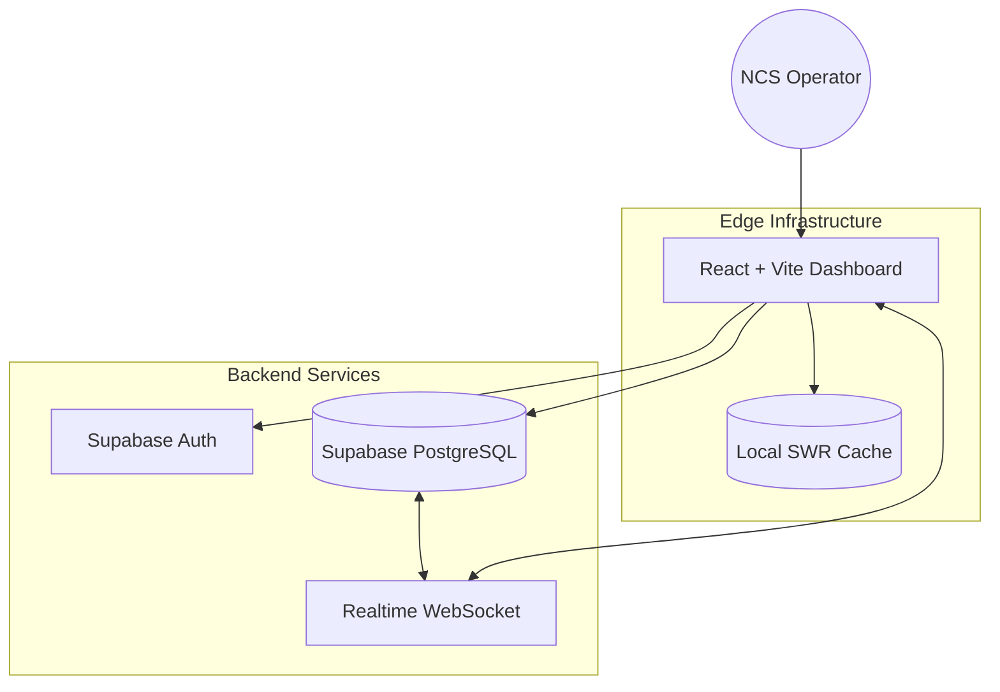
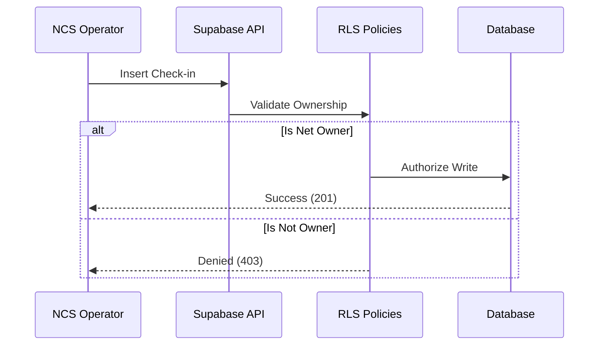

# 🎙️ 9M2PJU NCS Dashboard
### Amateur Radio Net Control Station • High-Performance Digital Logging

A premium, state-of-the-art dashboard designed for Amateur Radio Net Control Stations (NCS). Built for speed, security, and visual excellence, this dashboard streamlines on-air logging with real-time synchronization and "Stale-While-Revalidate" caching.

---

## 🏗️ System Architecture

The dashboard utilizes a modern serverless stack with a focus on **Real-time Synchronization** and **Edge Performance**.

---

## ⚡ Performance Engineered

The application is optimized to run on free-tier infrastructure while maintaining premium performance.

### 🏹 Stale-While-Revalidate (SWR)
Our custom caching layer ensures that the UI is never "waiting" for the database.
1. **Instant Memory**: Dashboard loads from local cache in **< 10ms**.
2. **Silent Sync**: Background requests verify data with Supabase.
3. **Smooth Update**: UI updates reactively only when new data is found.

### 📦 Dynamic Code Splitting
We use advanced tree-shaking and lazy loading to keep the initial payload light.
- **Heavy Modules**: Maps, Charts, and PDF generators are loaded **on-demand**.
- **Edge Routing**: Fast navigation between operations.

---

## 🛡️ Security Hardening

The 9M2PJU Dashboard follows the **Principle of Least Privilege (PoLP)**.

### 🔒 Key Security Features:
- **Hardened RLS**: Strict Row Level Security ensures users can only modify their own nets.
- **JWT Validation**: Automatic session health checks prevent token-related hangs.
- **Schema Isolation**: Refined database grants minimize the attack surface.

---

## 💎 Design Aesthetics

- **Glassmorphism**: Sleek, transparent UI elements with backdrop filters.
- **Vibrant HUD**: High-contrast, accessibility-aware color palette.
- **Real-time Feedback**: Optimistic UI updates for a "zero-latency" feel.

---

## 📊 Operation Insights

Analyze your Net's performance with integrated analytics:
- **Signal Strength Distribution**
- **Geospatial Mapping**
- **Participation Retention**
- **Automated PDF/ADIF Exports**

---

---

## ☕ Support the Project

If you find this dashboard useful for your station, consider supporting the development!

  
   
  

---

  <i>Developed for the Amateur Radio Community with ❤️ by 9M2PJU</i>

